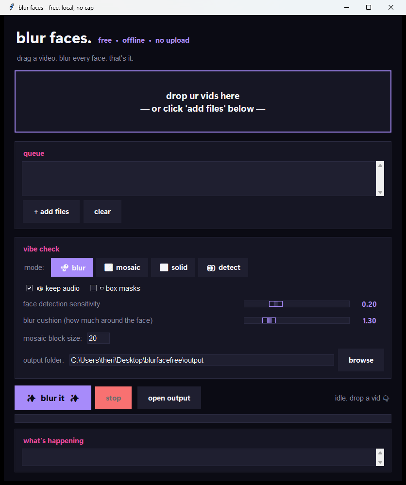

# Blur Faces Free — Easy Drag-and-Drop Face Blur for Videos (Windows + Mac)

> **Free, offline, local face-blur app for Windows and macOS.** Drag a video in, get the same video back with every face automatically blurred. No upload, no cloud, no watermark, no signup.

Automatically detect and blur faces in MP4, MOV, MKV, AVI, WEBM and more — right on your own computer. Powered by the open-source [deface](https://github.com/ORB-HD/deface) face-detection engine, wrapped in a friendly drag-and-drop GUI so anyone can use it.

**🌐 Looking for a hosted version, batch cloud processing, or a commercial license? Visit [freefaceblur.com](https://freefaceblur.com)** — the Pro version of this app.


[](https://freefaceblur.com)



---

## Why use it

- **Privacy-friendly** — videos never leave your PC. No upload, no account, no tracking.
- **Free forever** — open source, MIT licensed, zero cost, no watermark.
- **Automatic** — no clicking on faces frame-by-frame. The AI finds them for you.
- **Cross-platform** — runs on **Windows** and **macOS** (Intel & Apple Silicon).
- **Fast** — GPU acceleration on Windows (DirectML for Intel / AMD / NVIDIA); Neural Engine on Mac.
- **Batch friendly** — drop in 50 videos at once, get 50 blurred videos out.
- **Tunable** — sliders for sensitivity and coverage; choose blur, mosaic/pixelate, or solid block.
- **Audio preserved** — keep-audio is on by default.

Great for: **YouTube creators**, **TikTok / Reels / Shorts**, **journalists**, **researchers**, **GDPR / privacy compliance**, **bodycam footage**, **protest videos**, **classroom recordings**, **dashcam clips**, **real-estate walkthroughs**, anything where you need to anonymize people.

> Need it to scale beyond a single laptop? The Pro version at **[freefaceblur.com](https://freefaceblur.com)** does the same job in the cloud — no install, no Python, just upload-and-go.

---

## Quick start

### Windows (3 steps)

#### 1. Install Python (one time)

Download Python 3.10 or newer from **[python.org/downloads](https://www.python.org/downloads/)**.

> **Important:** during install, tick **"Add Python to PATH"** on the first screen. If you forget, just re-run the installer and choose *Modify → Add to PATH*.

#### 2. Download this app

- Click the green **Code → Download ZIP** button at the top of this page
- Right-click the ZIP → **Extract All**

(Or `git clone https://github.com/Teylersf/blurfacefree.git` if you use git.)

#### 3. Run the installer, then open the app

- Double-click **`install.bat`** — installs the face-detection engine. Takes ~1 minute.
- Double-click **`Blur Faces.bat`** — opens the drag-and-drop window.

That's it. Drag a video onto the big drop zone, click **Blur faces**, find the result in the `output\` folder.

---

### macOS (3 steps)

#### 1. Install Python (one time)

Get Python 3.10+ from **[python.org/downloads](https://www.python.org/downloads/)** (recommended — includes Tk).
If you prefer Homebrew: `brew install python-tk`.

#### 2. Download this app

Click **Code → Download ZIP** above, then double-click to extract. (Or `git clone` if you use git.)

#### 3. Run the installer, then open the app

Open the extracted folder in Finder.

- Double-click **`install.command`** — installs everything. Takes ~1 minute.
- Double-click **`Blur Faces.command`** — opens the app.

#### First-time Mac launch — getting past Gatekeeper

The first time you double-click a `.command` file, macOS may show **"cannot be opened because it is from an unidentified developer"**. That's expected — it's an unsigned shell script. Two ways past it:

- **Easiest:** Right-click the file → **Open** → click **Open** in the dialog. macOS remembers your choice.
- Or: **System Settings → Privacy & Security** → scroll down → click **Open Anyway** next to the blocked file.

Tk on Mac doesn't honor custom button colors the same way as Windows, so the UI will look more "native" (less Gen-Z). All features work identically.

---

> **Want zero setup?** The Pro version at **[freefaceblur.com](https://freefaceblur.com)** runs in your browser — drag a video in, download a blurred copy. No Python, no install, no terminal. Coming soon.

---

## How to use

1. Drag one or more videos onto the drop zone (or click **Add files...**).
2. Pick a mode:
   - **blur** — smooth Gaussian blur over each face (default)
   - **mosaic** — pixelated / mosaic censor
   - **solid** — solid black box
   - **none** — just draw detection ellipses (debug)
3. Adjust sliders if needed:
   - **Detection threshold** — lower = more aggressive (catches more faces, more false positives)
   - **Mask size** — bigger = more coverage around each face
4. Click **Blur faces**. Watch the log + progress bar.
5. Open the **output** folder to grab your anonymized videos.

### Supported video formats

`.mp4`  `.mov`  `.mkv`  `.avi`  `.webm`  `.m4v`  `.mpg`  `.mpeg`  `.wmv`  `.flv`

Output is always `.mp4` H.264 by default (works everywhere — YouTube, Premiere, Resolve, browsers).

---

## All options explained

| Option | What it does | When to change |
|---|---|---|
| **Mode** | Blur, mosaic, solid black, or none | Mosaic = TV-news censor look. Solid = strongest anonymization. |
| **Detection threshold** | How confident the AI must be before calling something a face. Default 0.2 | Lower to 0.1 if it's missing small / angled / blurry faces. Raise to 0.3+ if random objects get blurred. |
| **Mask size** | How much the blur extends around the detected face. Default 1.3× | Raise to 1.6–2.0 if hair / ears / chin keep peeking through. |
| **Keep audio** | Copy the original audio track through unchanged. **On by default.** | Turn off only if you want a silent output. |
| **Use rectangles** | Use a box mask instead of an ellipse | Boxes look more "official redaction"; ellipses look more natural. |
| **Mosaic block size** | Pixel size of mosaic squares | Bigger = chunkier pixels (more censored look). |
| **Output folder** | Where the blurred videos are written | Anywhere you like. Defaults to `.\output\`. |

---

## Command line (power users)

The GUI is a wrapper around the excellent [`deface`](https://github.com/ORB-HD/deface) CLI. After running the installer you can also call it directly:

**Windows (PowerShell):**
```powershell
deface "C:\path\to\video.mp4" --keep-audio
```

**macOS (Terminal):**
```bash
python3 -m deface ~/Movies/video.mp4 --keep-audio
```

Live webcam demo (both OSes):

```bash
deface cam
```

Full options: `deface --help`.

The repo also ships pre-made shortcut scripts:

| Action | Windows | macOS |
|---|---|---|
| Drag one or more videos onto the script | `blur.bat` | `blur.command` |
| Process every video in `./input/` → `./output/` | `blur-folder.bat` | `blur-folder.command` |

---

## Troubleshooting

<details>
<summary><b>"Python is not recognized" when I run install.bat</b></summary>

Python isn't on your PATH. Re-run the Python installer from python.org and tick **"Add Python to PATH"** on the first screen, or use the *Modify* button to add it after the fact.
</details>

<details>
<summary><b>The GUI opens but the drop zone says "Drag-drop unavailable"</b></summary>

The `tkinterdnd2` package didn't install correctly. In PowerShell:

```powershell
python -m pip install --upgrade tkinterdnd2
```

You can still use the **Add files...** button in the meantime.
</details>

<details>
<summary><b>It misses faces (small, blurry, side-profile, sunglasses)</b></summary>

Lower the detection threshold to **0.10** and raise the mask size to **1.7–2.0**. If you still see issues, switch to **mosaic** mode with a larger block size — pixelation forgives small detection errors.
</details>

<details>
<summary><b>Random non-face things are getting blurred</b></summary>

Raise the detection threshold to **0.30–0.40**.
</details>

<details>
<summary><b>It's slow on my machine</b></summary>

- Make sure GPU acceleration installed (`install.bat` does this automatically — look for `onnxruntime-directml` in the log).
- Try lowering the resolution the detector sees: command-line option `--scale 640x360` makes detection much faster with minimal accuracy loss on HD/4K videos.
- Close other GPU-heavy apps.
</details>

<details>
<summary><b>The first run is downloading something — is that OK?</b></summary>

Yes. On the very first run, deface downloads a ~2 MB face-detection model (CenterFace). After that, everything is 100% offline.
</details>

<details>
<summary><b>macOS: "<i>cannot be opened because it is from an unidentified developer</i>"</b></summary>

That's Gatekeeper blocking an unsigned shell script. Right-click `install.command` (or `Blur Faces.command`) → **Open** → click **Open** in the dialog. macOS will remember the choice. See the **First-time Mac launch** section above for details.
</details>

<details>
<summary><b>macOS: <i>"command not found: python3"</i></b></summary>

Python 3 isn't installed. Get it from **[python.org/downloads](https://www.python.org/downloads/)** (recommended — comes with Tk preinstalled), or via Homebrew: `brew install python python-tk`.
</details>

<details>
<summary><b>I need to process hundreds of videos / want a cloud version / need a commercial license</b></summary>

That's exactly what the Pro version at **[freefaceblur.com](https://freefaceblur.com)** is for — no install, no Python, no terminal, scales beyond a single laptop.
</details>

---

## How it works (short version)

1. The app launches the [deface](https://github.com/ORB-HD/deface) command on each video you drop in.
2. deface runs the **CenterFace** neural network (a tiny ~2 MB ONNX model) on every frame.
3. Each detected face region gets blurred / mosaiced / blacked-out.
4. Frames are re-encoded with ffmpeg, audio is muxed back in, and you get a new MP4.

No data leaves your machine. No telemetry. No accounts.

---

## Free vs Pro

| | **This repo (Free)** | **[Pro — freefaceblur.com](https://freefaceblur.com)** |
|---|---|---|
| Price | Free, MIT licensed | Paid plans |
| Where it runs | Your own PC / Mac | Cloud — runs in your browser |
| Install | Python + this repo | None — just visit the site |
| Speed | Limited by your hardware | Scaled cloud GPUs |
| Batch size | Whatever your disk fits | Unlimited |
| Commercial license | Use as-is under MIT | Included |
| Support | GitHub issues | Priority email + Slack |
| Best for | Hobbyists, devs, privacy-first users | Agencies, creators, businesses |

**👉 [Get the Pro version at freefaceblur.com](https://freefaceblur.com)**

---

## Credits

This project is a friendly GUI wrapper. **All the heavy lifting is done by these excellent open-source projects:**

- **[deface](https://github.com/ORB-HD/deface)** by [ORB-HD](https://github.com/ORB-HD) — the actual face-detection-and-anonymization engine. Please star their repo too.
- **[CenterFace](https://github.com/Star-Clouds/CenterFace)** — the underlying face-detection model.
- **[ONNX Runtime](https://onnxruntime.ai/)** — fast neural-network inference.
- **[ffmpeg](https://ffmpeg.org/)** — video encoding/decoding (via [imageio-ffmpeg](https://github.com/imageio/imageio-ffmpeg)).
- **[tkinterdnd2](https://github.com/pmgagne/tkinterdnd2)** — drag-and-drop in Tkinter.

If you use this for anything serious, please support those upstream projects.

---

## License

[MIT](LICENSE) — do whatever you want with it, just don't sue me. The underlying [deface](https://github.com/ORB-HD/deface) is also MIT licensed.

---

## Links

- **🌐 Pro / cloud version:** [freefaceblur.com](https://freefaceblur.com)
- **📦 This repo:** [github.com/Teylersf/blurfacefree](https://github.com/Teylersf/blurfacefree)
- **🐛 Issues / feature requests:** [github.com/Teylersf/blurfacefree/issues](https://github.com/Teylersf/blurfacefree/issues)
- **⬇️ Releases:** [github.com/Teylersf/blurfacefree/releases](https://github.com/Teylersf/blurfacefree/releases)

---

## Keywords

*Free face blur for video. Blur faces in video Windows. Blur faces in video Mac. Automatic face blur. Anonymize video faces. Hide faces in video free. Face blur software open source. Pixelate faces in video. Censor faces in video. GDPR video anonymization. Privacy face blur tool. Offline face blur. Face blur AI free. YouTube face blur free. TikTok face blur free. Video redaction tool free. Best free face blur software. Blur faces without watermark. Local face blur app. Drag and drop face blur. Free face blur Mac. macOS face blur. Apple Silicon face blur. Cloud face blur — see [freefaceblur.com](https://freefaceblur.com).*
